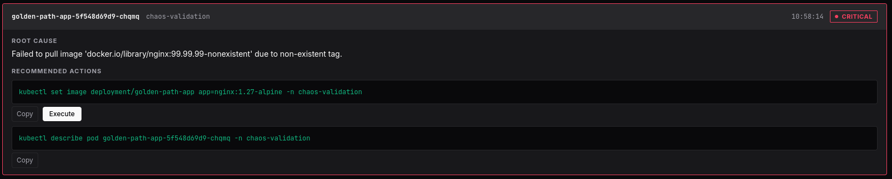
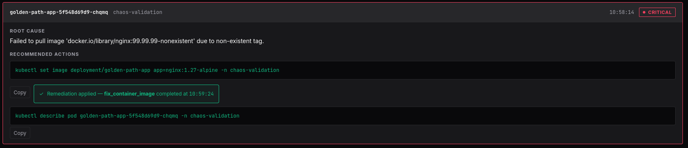

# AI-Driven Kubernetes Troubleshooting Pipeline

Asynchronous root-cause analysis and 1-click remediation for Kubernetes cluster failures.
Built with Spring Boot 3.5, Apache Kafka (KRaft), OpenSearch, and a Model Context Protocol (MCP) intelligence layer.

---

## The Core Challenge

Kubernetes failure modes are opaque by design. A `CrashLoopBackOff` might be a misconfigured liveness probe, a missing ConfigMap mount, or an OOM threshold set 10x too low. Operators spend disproportionate time correlating scattered signals — pod events, container logs, deployment specs — before reaching a diagnosis.

**This platform closes the gap between signal and action.** It watches the cluster in real time, streams failure events through Kafka, enriches them with live cluster context via MCP, feeds the combined payload to an LLM for structured root-cause analysis, and surfaces a concrete fix the operator can execute in one click — no kubectl gymnastics, no guesswork.

Key design decisions:

- **No free-text AI.** Every LLM response is validated against a strict JSON Schema contract. Unstructured output is rejected at the infrastructure boundary.
- **No direct cluster mutation without human approval.** Write-back tools are exposed through the UI as explicit actions, never triggered autonomously.
- **Operator-controlled lifecycle.** Every analysis card can be dismissed with an audit trail, or remediated with a single click. Both paths produce structured events for downstream processing.
- **Fail-fast over retry.** Three independent circuit breakers ensure a failing subsystem (AI provider, MCP server, or mutation path) degrades gracefully without contaminating healthy paths.

---

## Architecture Deep Dive

```
┌──────────────────────────────────────────────────────────────────────────────────────────┐
│                              KUBERNETES CLUSTER                                          │
│  ┌─────────────────────────┐                                                             │
│  │  Pods / Deployments     │─── Watch (Informers) ───┐                                   │
│  │  (chaos-validation ns)  │                         │                                   │
│  └─────────────────────────┘                         ▼                                   │
└──────────────────────────────────────────────────────────────────────────────────────────┘
                                              ┌─────────────────────┐
                                              │   k8s-collector     │
                                              │   (Spring Boot)     │
                                              │   Java 21 Informer  │
                                              └────────┬────────────┘
                                                       │ KubernetesEvent
                                                       ▼
┌──────────────────────────────────────────────────────────────────────────────────────────┐
│                         APACHE KAFKA (KRaft mode, single broker)                         │
│                                                                                          │
│   Topic: k8s-pod-events (3 partitions)       Topic: ai-analysis-events                   │
└───────────────────────┬──────────────────────────────────────────────────────────────────┘
                        │ Consumer Group: ai-analyzer-group
                        ▼
┌──────────────────────────────────────────────────────────────────────────────────────────┐
│                           ai-analyzer (Spring Boot 3.5 / Java 21)                        │
│                                                                                          │
│  ┌─────────────────┐    ┌─────────────────────────┐    ┌──────────────────────────────┐  │
│  │  Domain Layer   │    │  Application Service    │    │  Infrastructure Layer        │  │
│  │                 │    │                         │    │                              │  │
│  │  AiAnalysis     │    │  PodAnalyzerService     │    │  OllamaLanguageModelAdapter  │  │
│  │  RemediationCmd │    │  RemediationOrchestrator│    │  ByokLanguageModelAdapter    │  │
│  │  Ports (SPI)    │    │                         │    │  McpClientAdapter            │  │
│  └─────────────────┘    └─────────────────────────┘    │  RemediationAdapter          │  │
│                                                        │  OpenSearchQueryAdapter      │  │
│                                                        └───────────────┬──────────────┘  │
└────────────────────────────────────────────────────────────────────────┼─────────────────┘
                        │                                                │
          ┌─────────────┼────────────────────────────────────────────────┘
          │             │                          │
          ▼             ▼                          ▼
┌───────────────┐  ┌──────────────────┐   ┌────────────────────────────────────────────┐
│  OpenSearch   │  │  AI Provider     │   │  MCP Server (Node.js / TypeScript)         │
│               │  │                  │   │  JSON-RPC 2.0 over HTTP                    │
│  Index:       │  │  Ollama (local)  │   │                                            │
│  ai-analysis- │  │  — or —          │   │  Read Tools:                               │
│  reports      │  │  BYOK (cloud)    │   │    describe_pod, get_events, get_logs      │
│               │  │  OpenAI/Anthropic│   │  Write Tools (Zod-validated, idempotent):  │
└───────────────┘  └──────────────────┘   │    restart_deployment, scale_deployment,   │
                                          │    fix_container_image                     │
                                          └────────────────────────────────────────────┘
          ▲
          │ GET /api/v1/analyses
          │ POST /api/v1/remediations
          │ POST /api/v1/analyses/{id}/dismiss
          │
┌──────────────────────────────────────────────────────────────────────────────────────────┐
│                     Observability UI (React 18 / TypeScript / Tailwind CSS)              │
│                                                                                          │
│  TanStack Query polling (5s) — RFC 7807 error parsing — 1-click remediation — dismiss     │
│  Served via Nginx reverse-proxy (zero-CORS in container mode)                            │
└──────────────────────────────────────────────────────────────────────────────────────────┘
```

### Architectural Principles

| Principle | Implementation |
|-----------|---------------|
| **Hexagonal Architecture** | Pure domain layer with no framework annotations. Infrastructure adapters implement domain ports (SPI). |
| **Contract-First** | Every data boundary has a JSON Schema (`specs/schemas/`). AI output is validated before acceptance. |
| **Event-Driven Decoupling** | Kafka separates ingestion from analysis from persistence. Each stage can fail independently. |
| **MCP as Semantic Firewall** | The MCP Server is the sole gateway to cluster state. It exposes curated, parameterized tools — no raw kubectl passthrough. Runs in live mode with real K8s API access. |
| **BYOK (Bring Your Own Key)** | Runtime AI provider selection via environment variable. Supports Ollama (local) or any OpenAI-compatible endpoint. |
| **Supply-Chain Security** | All container images and CI actions are SHA-256 pinned. No mutable tags. |
| **Lifecycle Management** | Analysis reports follow a state machine (PENDING → DISMISSED / REMEDIATED). Dismissed analyses are excluded from active views. |

---

## Resiliency & Chaos Certification

The platform implements defense-in-depth resilience validated against four controlled failure scenarios:

| Failure Mode | Circuit Breaker | Behavior | Client Response |
|---|---|---|---|
| **MCP Server down** | `mutationCircuitBreaker` | Fail-fast after 3 failures. Write operations suspended. | HTTP 503 — `urn:problem-type:mutation-circuit-breaker-open` |
| **AI Provider timeout** | `aiCircuitBreaker` | Degraded `AiAnalysis` generated in-memory (verdict: `DEGRADED`). Pipeline continues. | Analysis card renders with "AI unavailable" state |
| **MCP context unreachable** | `mcpCircuitBreaker` | Prompt constructed without cluster context. Diagnosis proceeds with reduced enrichment. | Analysis shows `mcpContextAvailable: false` |
| **K8s resource deleted** | None (client error) | Structured JSON-RPC error propagated. CB not tripped. | HTTP 404 — `urn:problem-type:remediation-failure` |
| **Kafka paused** | None (buffering) | Producer buffers events in-memory (32 MB). Informer cache retains state. Ordered delivery on resume. | Delayed normal flow, no data loss |

All error responses conform to [RFC 7807 Problem Details](https://www.rfc-editor.org/rfc/rfc7807), ensuring machine-readable error surfaces end-to-end.

### Circuit Breaker Configuration

Three isolated Resilience4j circuit breakers prevent fault propagation between subsystems:

```
aiCircuitBreaker          → protects LLM inference path
mcpCircuitBreaker         → protects read-only cluster context retrieval
mutationCircuitBreaker    → protects write-back remediation operations
```

Each breaker operates with independent sliding windows, failure rate thresholds, and wait durations configurable via environment variables (see `.env.example`). The AI breaker is tuned for container startup resilience (window=20, rate=60%, wait=10s).

---

## Walkthrough — Golden Path Demo

The platform's canonical demo exercises the full pipeline in under 90 seconds:
chaos injection → event detection → MCP enrichment → AI diagnosis → 1-click remediation → pod recovery.

### Prerequisites

Ensure the platform is running (`make init` completed successfully) and a local K8s cluster (k3d) is active.

### Step 1: Injected Chaos — `ImagePullBackOff`

Create the namespace and deploy a pod with an invalid image reference:

```bash
kubectl apply -f deployments/chaos/namespace.yaml
kubectl apply -f deployments/chaos/golden-path-deployment.yaml
```

Wait ~40 seconds for the full pipeline to process (collector → Kafka → MCP enrichment → Ollama → OpenSearch → UI polling).

<!-- Screenshot: Pod in ImagePullBackOff state -->
```bash
NAME                               READY   STATUS             RESTARTS   AGE
golden-path-app-5f548d69d9-chqmq   0/1     ImagePullBackOff   0          23s
```

### Step 2: AI Root-Cause Analysis — Observability Dashboard

Open http://localhost:3000. The dashboard shows a CRITICAL card with the precise root cause (`ImagePullBackOff — invalid image reference`), and a `kubectl set image` command with an active **Execute** button:

<!-- Screenshot: Observability UI showing AI diagnosis card with CRITICAL_FAILURE verdict -->


### Step 3: Automated Healing — Pod Running

Click **Execute** next to the `kubectl set image` action. The MCP Server patches the deployment, a new ReplicaSet rolls out, and the card fades out as the pod transitions to `Running`:

<!-- Screenshot: Pod recovered to Running state after remediation -->


### Cleanup

```bash
kubectl delete -f deployments/chaos/golden-path-deployment.yaml
```

---

## Quick Start & Developer Experience

### Prerequisites

- Docker + Docker Compose (v2 plugin)
- kubectl
- Local K8s runtime (k3d recommended, kind or minikube also supported) — **must be running** before `make init`
- `~/.kube/config` accessible (the k8s-collector mounts it read-only)
- AI provider: Ollama running locally **or** a BYOK API key (OpenAI, Anthropic, DeepSeek)

### Bootstrap

```bash
# Clone and enter the project
git clone https://github.com/antonalag/k8s-ai-driven-event-pipeline.git
cd k8s-ai-driven-event-pipeline

# Full pre-flight validation + build + launch
make init
```

The `make init` target runs a comprehensive pre-flight script that:

1. Creates `.env` from `.env.example` if missing
2. Validates CLI dependencies (docker, kubectl, docker compose, K8s runtime)
3. Detects UFW firewall blocking Docker traffic and adds allow rule automatically
4. Checks AI provider availability (Ollama reachability + model pull, or BYOK endpoint validation)
5. Ensures Ollama listens on all interfaces (`0.0.0.0`) for Docker container access
6. Builds and launches all containers via Docker Compose

### Available Make Targets

| Command | Description |
|---------|-------------|
| `make init` | Pre-flight checks + build + launch all services |
| `make check` | Run pre-flight checks only (no launch) |
| `make up` | Start services (skip pre-flight — assumes already validated) |
| `make down` | Stop and remove all containers and volumes |
| `make test` | Run all test suites (backend + MCP + UI) |
| `make test-backend` | Run Java/Gradle tests only |
| `make test-mcp` | Run MCP Server TypeScript tests only |
| `make test-ui` | Run UI typecheck + lint + tests + build |
| `make build` | Build all containers without starting |
| `make clean` | Remove containers, volumes, and build artifacts |

### Service Endpoints (after `make init`)

| Service | URL |
|---------|-----|
| Observability UI | http://localhost:3000 |
| AI Analyzer API | http://localhost:8082 |
| K8s Collector | http://localhost:8081 |
| MCP Server Health | http://localhost:3001/health |
| OpenSearch | http://localhost:9200 |
| Kafka (external) | localhost:9092 |

### Environment Configuration

Copy `.env.example` to `.env` and configure your AI provider:

```bash
# For local Ollama (default)
PLATFORM_AI_PROVIDER=ollama
OLLAMA_API_URL=http://localhost:11434   # Used by bootstrap pre-flight only (containers use host.docker.internal)
OLLAMA_MODEL=llama3.1

# For cloud provider (OpenAI, Anthropic, DeepSeek)
PLATFORM_AI_PROVIDER=byok
BYOK_ENDPOINT=https://api.openai.com
BYOK_API_KEY=${YOUR_API_KEY}
BYOK_MODEL=gpt-4o
BYOK_PROVIDER_TYPE=OPENAI_COMPATIBLE
```

> **Note:** `OLLAMA_API_URL` in `.env` is used by `bootstrap.sh` for host-side validation. Inside Docker containers, Ollama is reached via `http://host.docker.internal:11434` (hardcoded in compose).

---

## Project Structure

```
k8s-ai-driven-event-pipeline/
├── services/
│   ├── k8s-collector/        # Kubernetes Informer → Kafka producer (Spring Boot)
│   ├── ai-analyzer/          # Consumer + AI reasoning + REST API (Spring Boot)
│   └── mcp-server/           # MCP tool server (Node.js/TypeScript, JSON-RPC 2.0)
├── ui/                       # Observability Dashboard (React + TypeScript + Vite)
├── deployments/
│   ├── docker-compose.yaml   # Global orchestration (all services + OpenSearch)
│   ├── docker-compose/       # Kafka infrastructure (KRaft mode)
│   └── chaos/                # Failure injection manifests (ImagePull, CrashLoop, OOM)
├── specs/schemas/            # JSON Schema contracts (k8s-event, ai-analysis)
├── scripts/
│   ├── bootstrap.sh          # Pre-flight validation & platform launcher
│   ├── remediation-smoke-test.sh  # Remediation API contract validation
│   └── mcp-smoke-test.sh     # MCP Server JSON-RPC verification
├── docs/
│   ├── system.spec.md        # System constitution & roadmap
│   ├── golden-path.md        # Demo scenario technical script
│   └── chaos-checks.md       # Resilience certification report
├── images/                   # Golden path walkthrough screenshots
├── .github/workflows/ci.yml  # CI pipeline (SHA-pinned, Trivy scan)
├── .dockerignore             # Build context exclusions
├── Makefile                  # Developer task runner
├── TROUBLESHOOTING.md        # Common errors & fixes guide
└── .env.example              # Configuration template
```

---

## Tech Stack

| Layer | Technology |
|-------|-----------|
| Language | Java 21 (backend), TypeScript 5 (MCP server + UI) |
| Framework | Spring Boot 3.5, React 18, Vite |
| Streaming | Apache Kafka 7.6 (KRaft mode, no ZooKeeper) |
| Persistence | OpenSearch 2.x (Spring Data OpenSearch) |
| AI | Ollama (local) or BYOK (OpenAI-compatible REST) |
| Cluster Intelligence | Model Context Protocol (JSON-RPC 2.0) |
| Resilience | Resilience4j (3 independent circuit breakers) |
| UI | TanStack Query, Tailwind CSS, Shadcn/ui |
| Containers | Docker Compose, Nginx reverse-proxy, SHA-256 pinned images |
| CI/CD | GitHub Actions (SHA-pinned), Trivy vulnerability scanning |
| Testing | JUnit 5, jqwik (PBT), ArchUnit, Vitest, fast-check, Testing Library |

---

## Security Posture

- All container images use SHA-256 digest pinning (no mutable tags)
- Containers run as non-root (`user: 1000:1000`) with `no-new-privileges` and read-only filesystems
- MCP mutation tools enforce Zod schema validation, namespace allowlisting, and idempotency deduplication
- No raw kubectl passthrough — only parameterized, bounded operations
- CI pipeline gates on Trivy `CRITICAL,HIGH` severity findings
- Secrets managed exclusively via environment variables (never committed)
- CORS disabled in container mode (Nginx proxies `/api/` internally)

---

## Troubleshooting

See [TROUBLESHOOTING.md](TROUBLESHOOTING.md) for solutions to common startup errors, Docker networking issues, AI provider connectivity, and Kubernetes cluster problems.

---

## License

See [LICENSE](LICENSE) for details.
